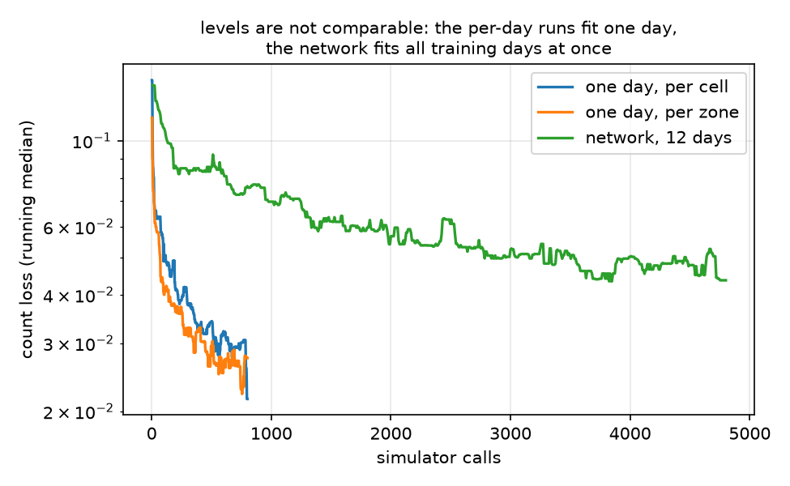
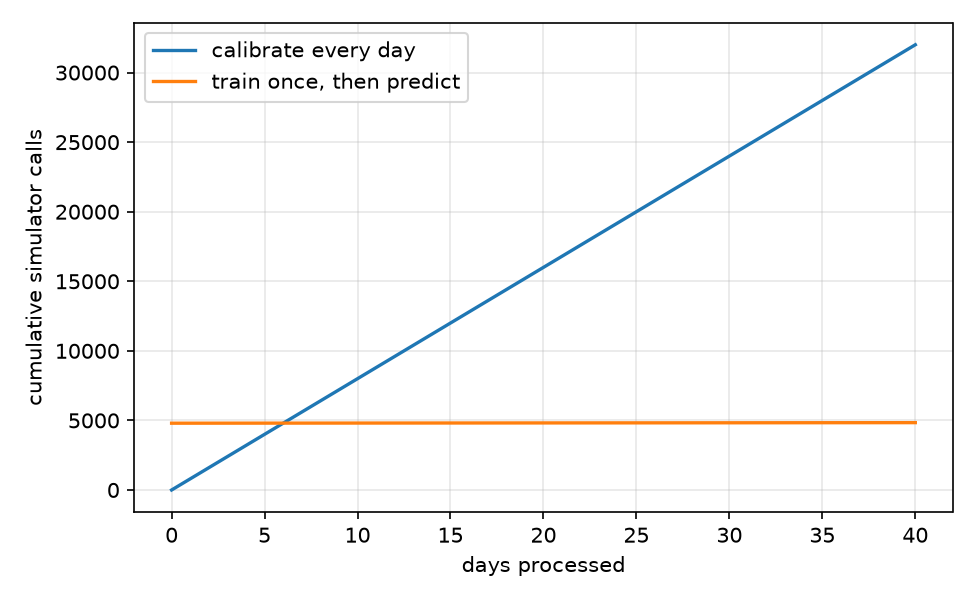

# spsa-od-toy

Correcting origin-destination (OD) matrices from sensor counts when the
traffic simulator is a **black box you cannot differentiate through**.

The question the repo asks is whether a small neural network, tuned with
Simultaneous Perturbation Stochastic Approximation (SPSA), can learn to
map a day's measured counts to an OD correction, so that a new day costs
one forward pass instead of a full calibration run.

Everything runs on a toy simulator, which is the point: the true OD of
every day is known, so a method that merely fits the sensors can be told
apart from one that actually recovers demand.

## The setup

A grid network with BPR link costs and method-of-successive-averages
assignment. Route choice is all-or-nothing on the shortest path, so the
OD -> flows map is not differentiable. A seed perturbs link capacities,
standing in for day-to-day variability; the same seed on both sides of an
SPSA perturbation is what keeps the gradient estimate usable.

Each scenario has a biased prior OD (the "planning model"), a set of days
with their own true OD, and counts measured at a subset of links with
relative noise. Methods see the prior and the counts. They never see the
true OD, and they are scored on days and sensors held out from fitting.

## Methods compared

| name | parameters | idea |
|---|---|---|
| `prior` | 0 | do nothing, the starting matrix |
| `gls` | one per cell | linearise the simulator with its assignment matrix, solve bounded least squares |
| `cells` | one per cell | SPSA on a log-factor per OD cell |
| `zones` | 2n+1 | SPSA on a global scale plus one factor per origin and per destination zone |
| `amortised` | network weights | one network maps count residuals to zone factors, trained across days with SPSA |

## Results

Five scenario seeds, 12 training days, 4 held-out test days, 18 fitting
sensors and 6 held out. Median over seeds, interquartile range in
brackets. Lower is better everywhere.

| method | loss (fit sensors) | loss (held-out sensors) | OD error | setup sims | sims / day |
|---|---|---|---|---|---|
| prior | 0.108 [0.106, 0.220] | 0.076 [0.058, 0.091] | 0.370 [0.332, 0.393] | 0 | 0 |
| gls | **0.015** [0.012, 0.020] | 0.041 [0.028, 0.094] | 0.401 [0.346, 0.404] | 0 | 3 |
| cells | 0.054 [0.050, 0.065] | 0.069 [0.041, 0.113] | 0.376 [0.329, 0.380] | 0 | 400 |
| zones | 0.034 [0.033, 0.037] | **0.038** [0.028, 0.061] | **0.313** [0.306, 0.314] | 0 | 400 |
| amortised | 0.063 [0.052, 0.064] | 0.041 [0.031, 0.057] | 0.344 [0.316, 0.349] | 4800 | **1** |

Three things come out of this.

**Fitting the sensors is not the same as estimating demand.** GLS fits
the measured links seven times better than the prior and still ends up
with a *worse* OD than the one it started from (0.401 against 0.370).
With roughly 240 free cells against 18 counts the problem is badly
underdetermined, and the extra freedom goes into demand that no sensor
can contradict. The per-cell SPSA run shows the same pattern more mildly.

**Structure is what buys accuracy.** Going from one parameter per cell to
2n+1 zone factors improves *every* column at the same simulation budget:
the fit is better, the held-out sensors are better, and the OD error
drops from 0.376 to 0.313. Fewer, better-chosen parameters beat more
parameters here.

**Amortisation is nearly free.** The network reaches most of the per-day
result at one simulation per day instead of 400. It gives up some
accuracy against `zones`, which is expected since it must serve all days
with one function, but it clearly beats the prior on days it has never
seen, which is the claim worth testing.



Loss against simulator calls. The per-day runs drop quickly because they
fit a single day; the network needs about 3000 calls to plateau. The
levels are not comparable across the two kinds of curve.



Where the training cost pays for itself. With these settings the network
overtakes per-day calibration after about 6 days, and the gap grows
linearly after that.

## Caveats

The toy is small (16 zones, 24 sensors) and the "days" vary in a way the
zone parametrisation is well suited to capture, so the comparison is
kinder to `zones` and to the network than a real network would be. The
OD error stays above 30% for every method: with counts on a fraction of
the links, most of the matrix is simply not observable, and the results
should be read as relative, not as an achievable accuracy.

## Setup

```bash
python -m venv .venv && source .venv/bin/activate
pip install -r requirements.txt
pip install -e .
pytest
```

| script | what it does |
|---|---|
| `examples/run_simulator.py` | one assignment, timing and flow statistics |
| `examples/make_days.py` | build a scenario, show how wrong the prior is |
| `examples/calibrate_day_spsa.py` | one day, per-cell vs per-zone SPSA vs GLS |
| `examples/amortised_network.py` | train the network, test on unseen days |
| `examples/compare_methods.py` | the table above, across seeds (~4 min) |
| `examples/make_figures.py` | the figures above |

## Package layout

- `odtoy/network.py`: synthetic grid network with random link capacities
- `odtoy/assignment.py`: BPR costs, MSA assignment, assignment matrix
- `odtoy/simulator.py`: `Simulator(od, seed) -> link flows`, counts its own calls
- `odtoy/days.py`: gravity-model mean OD, daily variations, biased prior
- `odtoy/sensors.py`: sensor placement, noisy counts, fit/holdout split
- `odtoy/scenario.py`: `make_scenario(seed)` bundles all of the above
- `odtoy/metrics.py`: relative count loss, GEH statistic, OD recovery errors
- `odtoy/spsa.py`: SPSA on a generic parameter vector, with common random numbers
- `odtoy/calibrate.py`: SPSA calibration, per OD cell or per zone factor
- `odtoy/gls.py`: iterated linearised GLS using the assignment matrix
- `odtoy/net.py`: small MLP whose weights are a single flat vector
- `odtoy/amortised.py`: the amortised network and its SPSA training loop
- `odtoy/experiments.py`: run every method on the same scenarios, aggregate over seeds
- `odtoy/plots.py`: the figures

## Possible extensions

- pre-train the network on the linearised simulator, then fine-tune with
  SPSA, to cut the 4800 training simulations
- a richer parametrisation between `zones` and `cells`, for instance
  principal components of historical OD matrices
- feed the network the prior as well, which only becomes useful once the
  prior varies by day type

## References

- Spall, J. C. (1992). Multivariate stochastic approximation using a simultaneous perturbation gradient approximation. *IEEE Transactions on Automatic Control*.
- Balakrishna, R., Ben-Akiva, M., Koutsopoulos, H. (2007). Offline calibration of dynamic traffic assignment. *Transportation Research Record*.
- Lu, L., Xu, Y., Antoniou, C., Ben-Akiva, M. (2015). An enhanced SPSA algorithm for the calibration of dynamic traffic assignment models. *Transportation Research Part C*.
- Qurashi, M., Ma, T., Chaniotakis, E., Antoniou, C. (2019). PC-SPSA: employing dimensionality reduction to limit SPSA search noise in DTA model calibration. *IEEE Transactions on Intelligent Transportation Systems*.
